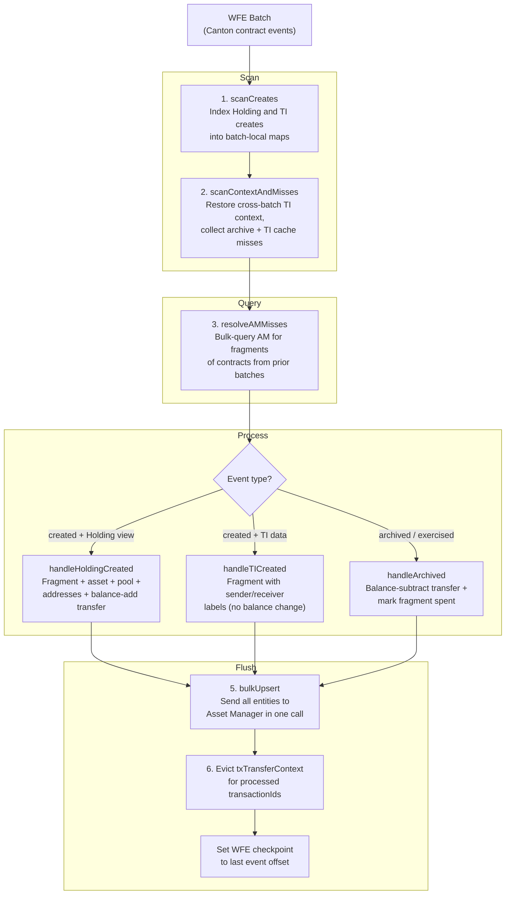
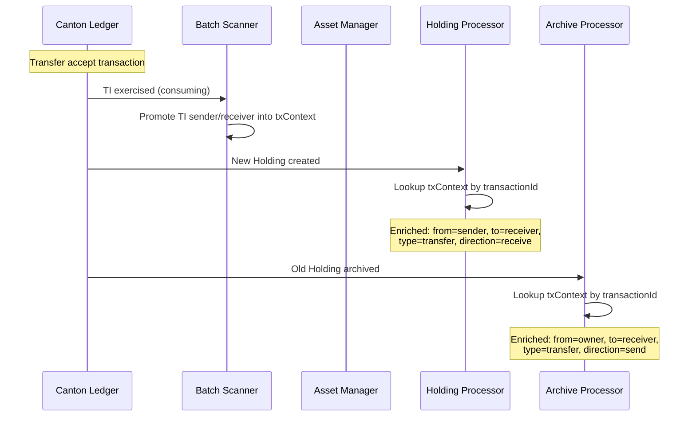

# Canton CIP-56 Indexer

Indexes Canton ledger events (CIP-56 Holdings and TransferInstructions) into
the Asset Manager data model (fragments, transfers, addresses, assets, pools).

## Batch Pipeline

Each WFE batch is processed in six stages:



## Transfer Enrichment Flow

When a TransferInstruction (TI) is accepted, the Canton ledger emits three
events in one transaction: TI exercised (consumed), old Holding archived,
new Holding created. The indexer correlates these via `transactionId`:



When the TI was created in a prior batch (e.g. after a restart), the scanner
queries the Asset Manager for the TI fragment and reconstructs the
sender/receiver from its stored labels.

## File Structure

```
canton/
  types.ts                 All types (Canton events, CIP-56 views, indexer context)
  helpers.ts               Pure functions (parsing, normalization, scaling, predicates)
  indexer.ts               Pipeline orchestrator (scan → query → dispatch → flush)
  processors/
    batch-scanner.ts       Scan passes + AM miss resolution
    archive-processor.ts   Archive handling (both Holdings and TIs) + owner resolution
    holding-processor.ts   Holding create → fragment, asset, pool, addresses, transfer
    ti-processor.ts        TI create → fragment with sender/receiver labels
```

## Contract Types

| Contract | Interface | Creates | Archives |
|---|---|---|---|
| **Holding** | `HoldingV1:Holding` | Fragment (balance), asset, pool, addresses, balance-add transfer | Balance-subtract transfer, mark fragment spent |
| **TransferInstruction** | `TransferInstructionV1:TransferInstruction` | Fragment (no balance), sender/receiver in labels | Mark fragment spent (no balance change) |

## State Model

- **Batch-local maps** — contract metadata and TI context are rebuilt from
  scratch for each batch. No persistent in-memory caches.
- **txTransferContext** — the only cross-batch state. Maps `transactionId` →
  `TransferContext` (sender, receiver, instrumentId) for TIs that were
  exercised. Evicted after each batch that references the transactionId.
- **Asset Manager as fallback** — when an archive references a contract from
  a prior batch, the indexer queries AM for the stored fragment to recover
  owner, amount, and pool data.
